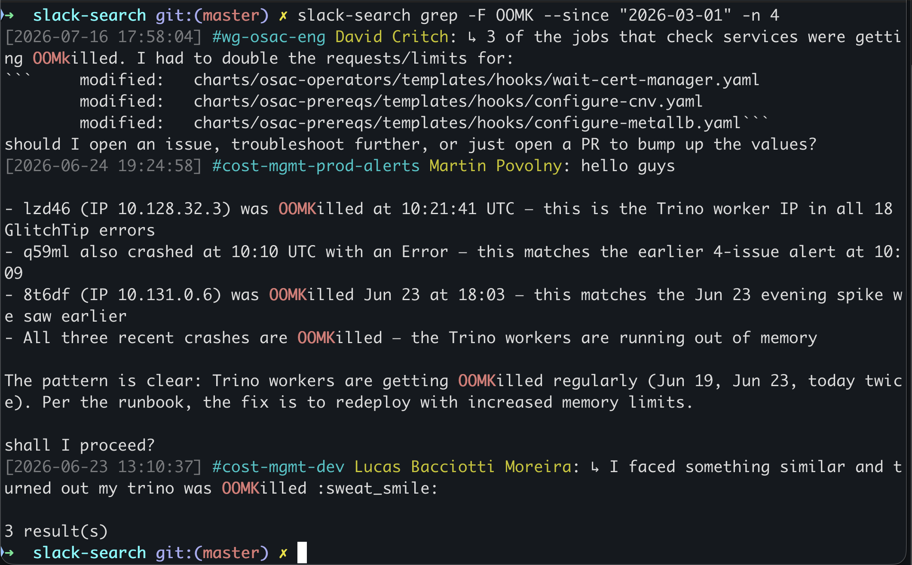

# slack-search

Download Slack channels to a local SQLite database. Search with grep, SQL, natural language, or through a web UI. Works as an MCP server for AI agents.


## Quick Start

```bash
# 1. Install
go install github.com/martinpovolny/slack-search/cmd/slack-search@latest

# 2. Get credentials — Chrome DevTools → Network → any Slack API call → Copy as cURL
pbpaste > ~/.slack-search/.curl    # macOS; on Linux: xclip -o > ~/.slack-search/.curl

# 3. Download a channel
slack-search download --channel general --since "4 weeks ago" --curl-file ~/.slack-search/.curl

# 4. Search
slack-search grep -F "outage"
```

## grep



```bash
slack-search grep -F "out of memory"                          # literal string
slack-search grep -E "error|warning" -c my-channel            # regex, specific channel
slack-search grep -F "budget" -p Alice --since "2 weeks ago"  # by person + time range
```

## SQL

```bash
slack-search search "
  SELECT u.real_name, count(*) AS msgs
  FROM messages m JOIN users u ON m.user_id = u.id
  GROUP BY u.id ORDER BY msgs DESC LIMIT 10"
```

## Web UI

```bash
slack-search serve    # includes background channel refresh
```

Open http://localhost:8088 — SQL, natural language queries, Slack live search, message permalinks.

## More Commands

| Command | What it does |
|---------|-------------|
| `download` | Download a channel (incremental) |
| `refresh` | Update all previously downloaded channels |
| `grep` | Search by text or regex with highlights |
| `search` | Raw SQL against the archive |
| `live-search` | Query Slack's search API, cache results locally |
| `nlq` | Natural language → SQL → answer (requires LLM) |
| `serve` | Web UI with background refresh |
| `mcp` | MCP server for AI agents |

## Keeping Channels Up to Date

**`slack-search serve`** handles this automatically. If you only use the CLI:

```bash
slack-search refresh --curl-file ~/.slack-search/.curl --lookback 7
```

On macOS, a launchd plist is included for hourly background refresh — see `com.user.slack-refresh.plist`.

## AI Agent Integration

### MCP Server

```json
// ~/.cursor/mcp.json
{
  "mcpServers": {
    "slack-search": { "command": "slack-search", "args": ["mcp"] }
  }
}
```

Claude Code: `claude mcp add slack-search -- slack-search mcp`

Tools: `slack_grep`, `slack_sql`, `slack_thread`, `slack_channels`, `slack_schema`

### Skill file (alternative)

Copy [`docs/slack-search-skill.md`](docs/slack-search-skill.md) to `.claude/commands/slack-search.md` — the agent calls the CLI via Bash. Includes full schema reference and query cookbook.

## Database

SQLite at `~/.slack-search/messages.db`:

```
messages  (ts, channel_id, user_id, username, text, timestamp, thread_ts, reply_count)
channels  (id, name, subscribed)
users     (id, name, real_name, display_name)
files     (id, ts, channel_id, name, mimetype, url, local_path)
```

## Python version

The `python/` directory contains the original Streamlit-based implementation, used for prototyping. The Go binary is the primary tool.
