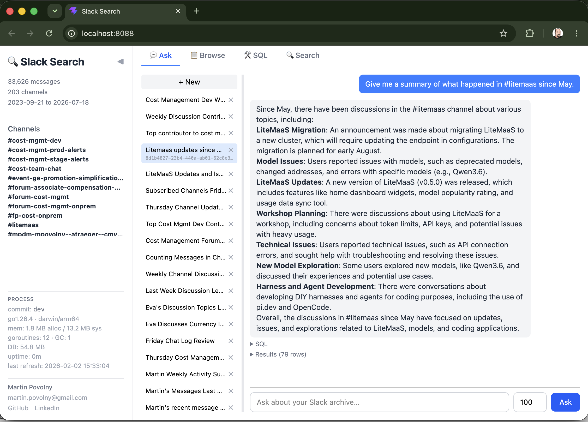

# slack-search

Local Slack archive with fast search. Download channels, search with SQL, regex, or natural language — all offline.



## Install

```bash
# Build from source (requires Go 1.22+)
go install github.com/martinpovolny/slack-search/cmd/slack-search@latest

# Or clone and build
git clone https://github.com/martinpovolny/slack-search.git
cd slack-search && go build -o slack-search ./cmd/slack-search
```

Data is stored in `~/.slack-search/messages.db` (SQLite).

## Setup

Get credentials from your browser — open Slack in Chrome, DevTools → Network, find any API request, right-click → **Copy as cURL**, save to a file:

```bash
pbpaste > ~/.slack-search/.curl
```

The `xoxc-` token and session cookies typically remain valid for weeks to months.

## Download channels

```bash
# Download a channel (incremental — only new messages)
slack-search download --channel cost-mgmt-dev --since "3 weeks ago" --curl-file ~/.slack-search/.curl

# Refresh all previously downloaded channels
slack-search refresh --curl-file ~/.slack-search/.curl

# Refresh + catch up thread replies from last 7 days
slack-search refresh --curl-file ~/.slack-search/.curl --lookback 7
```

### Keeping channels up to date

**Option A: `slack-search serve`** (recommended) — the web UI runs background refresh automatically. No extra setup needed.

**Option B: macOS launchd** — if you only use the CLI and don't run `serve`:

```bash
ln -sf "$(pwd)/com.user.slack-refresh.plist" ~/Library/LaunchAgents/
launchctl bootstrap gui/$(id -u) ~/Library/LaunchAgents/com.user.slack-refresh.plist
```

Check status: `launchctl list | grep slack-refresh`
Logs: `tail -f /tmp/slack-refresh.log`

## CLI Usage

### grep — fast text search

```bash
slack-search grep -F "out of memory"                          # literal string
slack-search grep -E "error|warning" -c cost-mgmt-dev         # regex in a channel
slack-search grep -F "budget" -p Martin --since "2 weeks ago"  # by person + time
slack-search grep -E "deadlock" -c cost-mgmt-dev -P            # paged output
```

### search — raw SQL

```bash
slack-search search "
  SELECT u.real_name, count(*) AS msgs
  FROM messages m JOIN users u ON m.user_id = u.id
  GROUP BY u.id ORDER BY msgs DESC LIMIT 10"
```

### live-search — query Slack's search API

Searches Slack directly and caches results locally:

```bash
slack-search live-search --curl-file ~/.slack-search/.curl "SPSE principal engineer" -n 20
```

### nlq — natural language queries

```bash
slack-search nlq --model llama-3-3-70b-instruct-fp8-dynamic "who sends the most messages?"
```

## Web UI

```bash
slack-search serve
```

Open http://localhost:8088. Features:
- SQL and natural language query tabs
- Slack live search (with `.curl` credentials)
- Message highlighting and "Open in Slack" permalinks
- LLM provider selection (RHT models.corp, local LM Studio)

## AI Agent Integration

Two ways to give an AI agent access to your Slack archive:

### Option A: MCP Server (recommended for Cursor / Claude Desktop)

Structured tool calls — the agent discovers tools automatically.

**Cursor / Claude Desktop** — add to `~/.cursor/mcp.json`:

```json
{
  "mcpServers": {
    "slack-search": {
      "command": "slack-search",
      "args": ["mcp"]
    }
  }
}
```

**Claude Code:**

```bash
claude mcp add slack-search -- slack-search mcp
```

**Available tools:**

| Tool | Description |
|------|-------------|
| `slack_grep` | Search messages by keyword or regex, with channel/person/date filters |
| `slack_sql` | Execute raw SQL against the archive (read-only, SQLite) |
| `slack_thread` | Fetch all messages in a thread by parent timestamp |
| `slack_channels` | List subscribed channels in the archive |
| `slack_schema` | Get DB schema, useful joins, and SQLite date function cheatsheet |

### Option B: Skill file (recommended for Claude Code)

Copy [`docs/slack-search-skill.md`](docs/slack-search-skill.md) into your project's `.claude/commands/` directory. The agent runs the Go CLI via Bash tool calls — no MCP protocol needed, works everywhere.

```bash
cp docs/slack-search-skill.md /path/to/your-project/.claude/commands/slack-search.md
```

Then invoke as `/slack-search <your question>` in Claude Code.

The skill includes the full CLI reference, database schema, SQLite dialect gotchas, and recommended query workflows.

## Python version

The original Python implementation (Streamlit UI, `uv run` commands) is in the `python/` directory. Used for prototyping new features. The Go binary is the primary tool — it's faster, self-contained, and includes the web UI.

## Database

SQLite at `~/.slack-search/messages.db`. Key tables:

```
messages  (ts, channel_id, user_id, username, text, timestamp, thread_ts, reply_count)
channels  (id, name, subscribed)
users     (id, name, real_name, display_name)
files     (id, ts, channel_id, name, mimetype, url, local_path)
```
