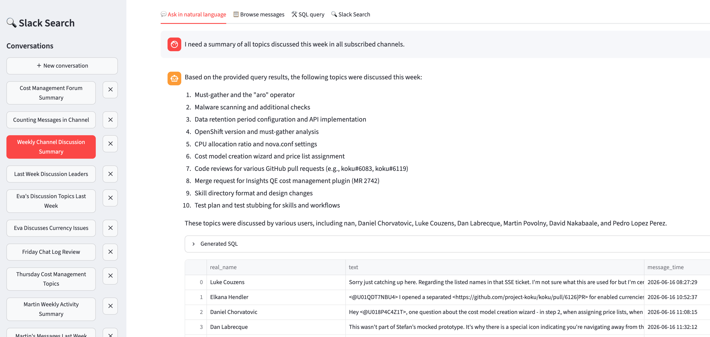
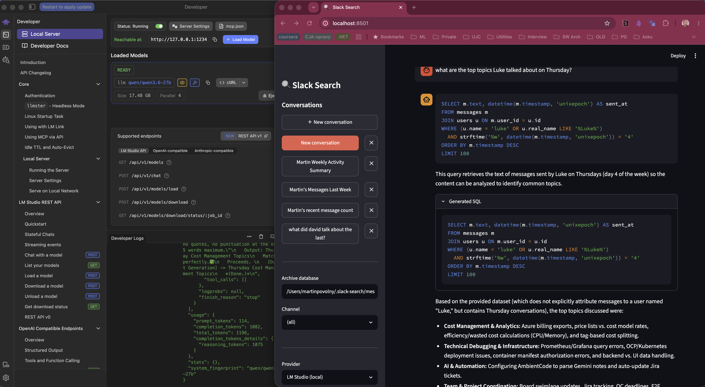

<!-- _class: lead -->

# slack-search

## Local Slack Archive with SQL and Natural Language Search

Martin Povolný — 2026-06-21

---

## The Problem

Slack search is limited — especially on Enterprise:

- Full history locked behind a slow UI with primitive keyword search
- No cross-channel queries, no aggregations, no date arithmetic
- Enterprise Slack restricts API access — `conversations.list` is banned
- Messages scroll off awareness: "we discussed this 6 months ago" → lost

**What if you could ask:**
> *"What did the team say about OOM errors in the last 3 months?"*
> *"Who raised the topic of cost limits in cost-mgmt-dev?"*
> *"Summarise what happened in #incident-response last week."*

---

## Data Flow


**Incremental sync:** `download_state` table tracks latest timestamp per channel — reruns only fetch new messages.

---

<!-- _class: backup -->

## [ optional ] What is RAG?

<div class="columns">
<div>

**RAG — Retrieval-Augmented Generation** grounds LLM answers in real data rather than training memory.

**Classic pipeline:**

1. **Retrieve** — find relevant documents (vector search, SQL, keyword…)
2. **Augment** — prepend them to the LLM prompt as context
3. **Generate** — LLM produces an answer grounded in what was retrieved

> Without retrieval, the LLM answers from training memory — stale, hallucination-prone, and blind to your private data.

**Why it works:** LLMs are excellent at reading, summarising, and reasoning over text they are *given*. RAG feeds them the right text at query time.

</div>
<div>

**How slack-search implements it:**

```
User: "What did we decide about GCP quotas last month?"
         ↓
① RETRIEVE
   SQL query → 47 matching messages from local SQLite
         ↓
② AUGMENT
   Messages prepended to LLM prompt as context
         ↓
③ GENERATE
   LLM synthesises a plain-English answer
```

The `[SYNTHESISE]` mode is RAG with **SQL as the retrieval layer** — no vector database required.

SQL retrieval is exact and auditable: every claim in the answer traces back to a real Slack message.

</div>
</div>

---

## Enterprise Slack Auth — The Tricky Part

Enterprise Slack rejects standard API tokens in the `Authorization` header.

**Solution:** Extract credentials from a browser "Copy as cURL":

```bash
slack-search download --curl "$(cat .curl)" --channel cost-mgmt-dev --since "3 weeks ago"
```

The `--curl` flag parses the full Chrome DevTools curl command:
- Extracts the `xoxc-` token from the form body
- Extracts **all** session cookies (not just `d=xoxd-…`)
- Sends them as a `Cookie` header on every POST — exactly as the browser does

> Setup: open Slack in Chrome → DevTools → Network tab → copy any API request as cURL → save to `.curl`. Session cookies expire — re-export when downloads start failing.

---

## Three Query Modes

<div class="columns3">
<div>

### grep

Regex / full-text over local archive.

```bash
slack-search grep -E \
  "out.of.memory|OOMKill"
```

- Instant, no LLM
- Regex support
- Shows context lines
- Color highlights

Best for: **known strings**, log fragments, exact error messages.

</div>
<div>

### SQL

Raw SQLite — full power.

```bash
slack-search search "
SELECT u.real_name,
  count(*) as msgs
FROM messages m
JOIN users u
  ON m.user_id = u.id
GROUP BY u.id
ORDER BY 2 DESC
LIMIT 10"
```

Best for: **aggregations**, joins, date filters, power users.

</div>
<div>

### NLQ

Natural language → SQL.

```bash
LLM_BASE_URL=... \
slack-search nlq \
  "who sends the most
   messages this month?"
```

LLM generates SQL, executes it, returns results.

**Synthesise mode:** results sent back to LLM for a plain-English answer.

Best for: **exploratory questions**, non-SQL users.

</div>
</div>

---

## grep — Color Highlights in the Terminal

<a href="slack-search-cli-search.png" target="_blank"></a>

*Regex search for OOM errors — instant, no LLM, color-highlighted matches with context lines.*

---

## NLQ — Natural Language to SQL

The LLM receives the database schema and generates SQL from a plain question.

```
User: "What topics came up most in cost-mgmt-dev last month?"

LLM:  [SYNTHESISE]
      SELECT substr(text, 1, 120) as snippet, timestamp
      FROM messages
      WHERE channel_id = (SELECT id FROM channels WHERE name = 'cost-mgmt-dev')
        AND timestamp >= unixepoch('now', '-1 month')
      ORDER BY timestamp DESC
      LIMIT 100
```

**`[SYNTHESISE]` mode:** when the LLM prefixes its response with this tag, the results (up to 100–1000 rows, configurable) are sent back to the LLM which returns a plain-English summary instead of a raw table.

```
Answer: "Last month cost-mgmt-dev focused on three themes:
  (1) GCP quota increases requested by the infra team (12 messages, week of Jun 3),
  (2) Budget alert thresholds — a spike of 23 messages on Jun 11 after an alert fired,
  (3) Discussion of spot vs on-demand instance cost tradeoffs (ongoing, 8 participants)."
```

---

## NLQ — In the Terminal

<a href="screenshot-nlq-terminal.png" target="_blank"></a>

*"who has sent the most messages in cost-mgmt-dev this month?" — LLM generates the SQL (with date filter), executes it, returns the table.*

---

## NLQ — Synthesise Mode (Web UI)

<a href="screenshot-web-synthesise.png" target="_blank"></a>

*Plain-English summary first, generated SQL and raw rows below — full transparency on how the answer was produced.*

---

## LLM Backend — Privacy First

<div class="columns">
<div>

### RHT IT Inference API *(recommended)*

OpenAI-compatible endpoint on **Red Hat infrastructure** — company data never leaves the network.

```bash
export LLM_BASE_URL=https://developer.models.corp.redhat.com/v1
export LLM_API_KEY=<your-token>
export LLM_MODEL=<model-from-portal>
```

- **Portal:** [developer.models.corp.redhat.com](https://developer.models.corp.redhat.com)
- **Docs:** [gitlab.cee.redhat.com/models-corp/user-documentation](https://gitlab.cee.redhat.com/models-corp/user-documentation)
- 30-day token — takes ~5 minutes to set up
- No data sent to OpenAI, Anthropic, or any external provider

</div>
<div>

### Local inference *(fully offline)*

<div class="warn">

**Any OpenAI-compatible endpoint works** — one env var swap, no code changes.

</div>

| Tool | Notes |
|---|---|
| **Ollama** | `ollama run qwen2.5-coder:7b` — one command |
| **llama.cpp** | Maximum control, low RAM options |
| **LM Studio** | GUI, good for non-CLI users |

<a href="screenshot-lmstudio.png" target="_blank"></a>

</div>
</div>

---

## Usage — Summarising What Happened

Synthesise mode makes the tool useful for **situational awareness**, not just search.

```bash
# Catch up after a week off
slack-search nlq "summarise the main decisions made in #platform-eng last week"

# Incident retrospective
slack-search nlq "what was discussed about the production outage on June 11?"

# Find the origin of a decision
slack-search nlq "when did we first discuss moving to spot instances, and who raised it?"

# Cross-channel topic tracking
slack-search nlq "find all mentions of 'GCP quota' across channels in the last month"
```

> These would take 20+ minutes of manual Slack scrolling.
> With a local archive and NLQ, they take seconds.

---

## Cross-Project — Querying Slack from Any Codebase

A Claude Code slash command makes the Slack archive available **inside any project session**.

```markdown
# .claude/commands/search-slack.md  (or ~/.claude/commands/ for global access)

Search the local Slack archive for discussions relevant to the current task.

Run: uv run --project /path/to/slack-search slack-search nlq "$ARGUMENTS"

Use this when:
- Investigating a bug that may have hit production before
- Finding the original context behind a technical decision
- Checking if a similar incident was discussed in #incident-response
```

**Example workflow:**
```
User: /search-slack "kubernetes OOMKill cost-mgmt namespace"
→ Finds 3 threads from March discussing the same issue
→ Links to the incident thread where the fix was agreed
→ Claude uses this context to inform the current fix
```

> Past Slack discussions become searchable institutional memory,
> accessible directly from the coding context.

---

## Quality Loop — `/analyze-chat`

`.claude/commands/analyze-chat.md` — LLM as a Judge applied to SQL generation quality.

When a NLQ answer looks wrong, invoke `/analyze-chat <conversation-id>`:

- Fetches the conversation from the local DB
- Checks SQL correctness (date filters, name matching, weekday offsets)
- Checks mode selection (should synthesise mode have been used?)
- Checks answer quality (did synthesis correctly reflect the results?)

```
Issues found:
🔴 SQL uses datetime(...) LIKE '...' for date filter — should use unixepoch()
🟡 Question asked "what happened" — synthesise mode should have been used
🟢 User name filter looks correct
```

**The same eval → fix → re-run loop, applied to SQL generation quality.**

---

<!-- _class: lead -->

## Summary

**slack-search** turns Slack into a queryable local archive.

Three query modes: **grep · SQL · NLQ** — from instant regex to plain-English summaries.

Privacy-first: runs against **RHT IT Inference API** (company data stays internal) or fully local with Ollama / LM Studio.

Slash command integration brings **institutional memory into any coding agent session**.

> Slack discussions are institutional knowledge.
> slack-search makes that knowledge searchable, queryable,
> and available at the point where you need it — in your coding context.
