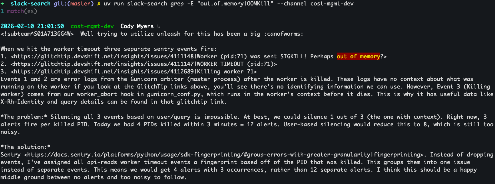
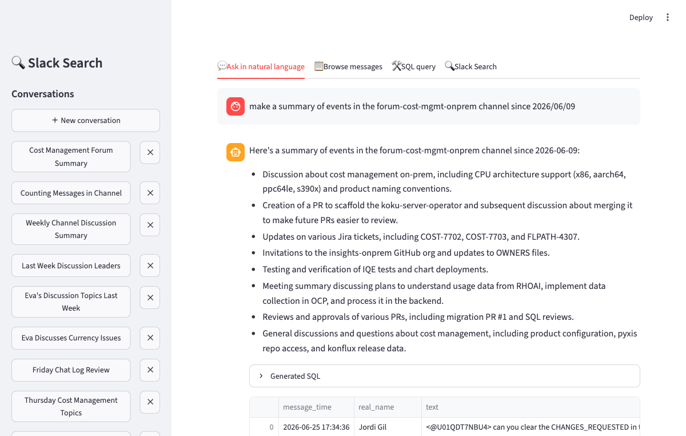
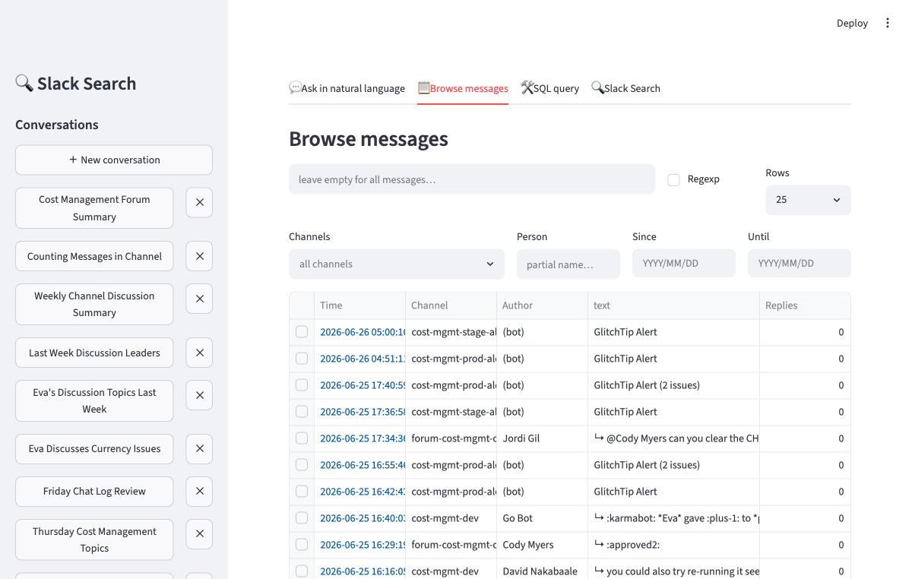
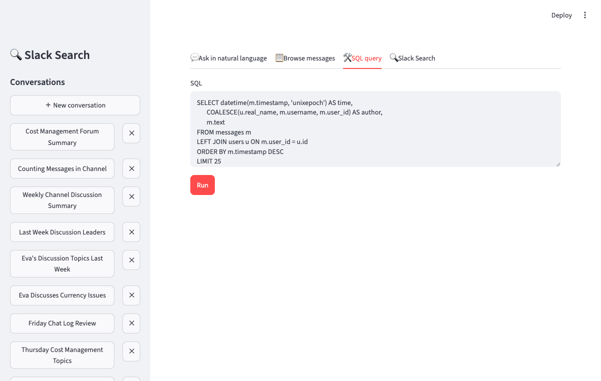
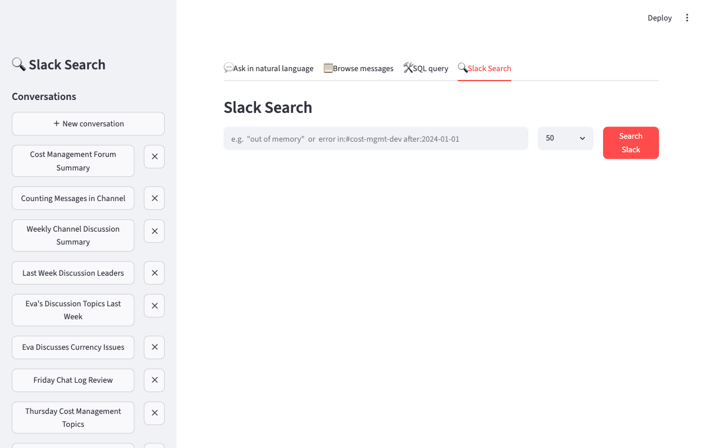
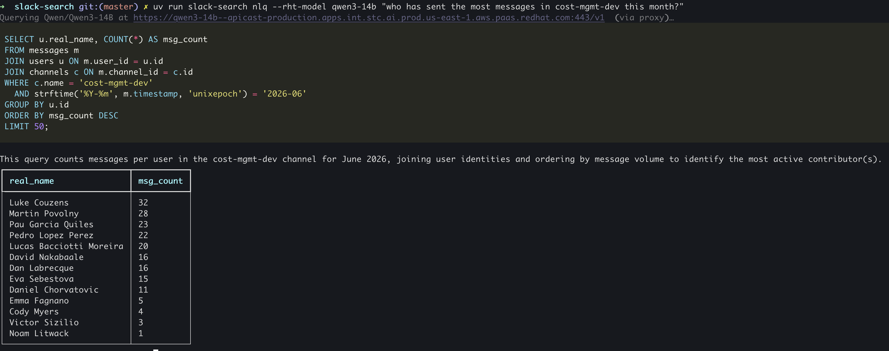
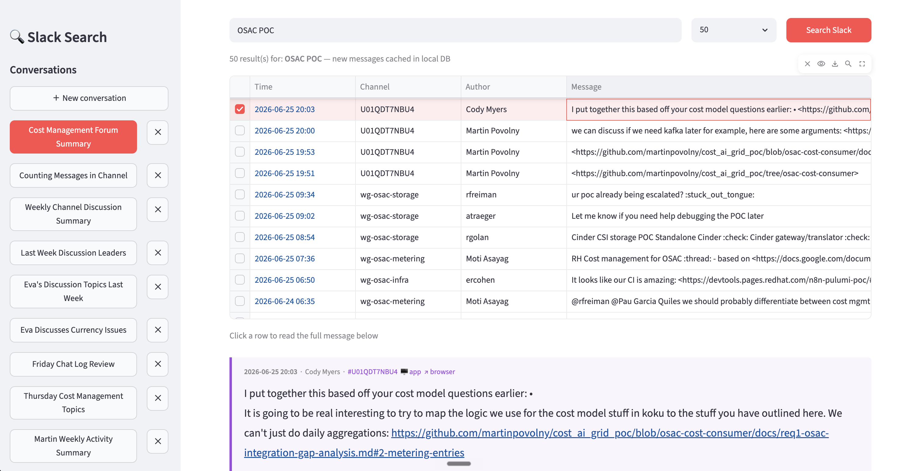

<!-- _class: lead -->

# slack-search

## Local Slack Archive with SQL and Natural Language Search

Martin Povolny — 2026-06-26

---

## The Problem

Slack search is limited — especially on Enterprise:

- Full history locked behind a slow UI with primitive keyword search
- No cross-channel queries, no aggregations, no date arithmetic
- Enterprise Slack restricts API access — `conversations.list` is banned
- Old discussions vanish from team memory: "we discussed this 6 months ago" → lost

**What if you could ask:**
> *"What did the team say about OOM errors in the last 3 months?"*
> *"Who raised the topic of cost limits in cost-mgmt-dev?"*
> *"Summarise what happened in #forum-cost-mgmt last week."*

---

## Data Flow



**Incremental sync:** `download_state` table tracks latest timestamp per channel — reruns only fetch new messages. Scheduled hourly via macOS launchd.

---

## Enterprise Slack Auth

Enterprise Slack rejects standard API tokens in the `Authorization` header.

**Solution:** Extract credentials from a browser "Copy as cURL":

```bash
slack-search download --curl "$(cat .curl)" --channel cost-mgmt-dev --since "3 weeks ago"
```

The `--curl` flag parses the full Chrome DevTools curl command:
- Extracts the `xoxc-` token from the form body
- Extracts **all** session cookies (not just `d=xoxd-…`)
- Sends them as a `Cookie` header on every POST — exactly as the browser does

**Credential lifetime:** `xoxc-` tokens + cookies remain valid for weeks to months. Invalidated by logout or password change — not by a timer. Auth errors are detected automatically with a clear "refresh your `.curl`" message.

---

## Three Query Modes

<div class="columns3">
<div>

### grep

Regex / full-text over local archive.

```bash
slack-search grep -E \
  "out.of.memory|OOMKill"
```

- Instant, no LLM
- Regex support
- Color highlights

Best for: **known strings**, log fragments, exact error messages.

</div>
<div>

### SQL

Raw SQLite — full power.

```bash
slack-search search "
SELECT u.real_name,
  count(*) as msgs
FROM messages m
JOIN users u
  ON m.user_id = u.id
GROUP BY u.id
ORDER BY 2 DESC
LIMIT 10"
```

Best for: **aggregations**, joins, date filters.

</div>
<div>

### NLQ

Natural language → SQL.

```bash
slack-search nlq \
  "who sends the most
   messages this month?"
```

LLM generates SQL, executes it, returns results.

**Synthesise mode:** results sent back to LLM for a plain-English answer.

Best for: **exploratory questions**.

</div>
</div>

All three modes available in the **Streamlit web UI** and via CLI.

---

## grep — Color Highlights in the Terminal

<a href="slack-search-cli-search.png" target="_blank"></a>

*Regex search — instant, no LLM, color-highlighted matches with context lines.*

---

## Web UI — Streamlit

<div class="grid2x2">
<div><a href="screenshot-ui-nlq.png" target="_blank"></a><div class="cap">Ask in natural language</div></div>
<div><a href="screenshot-ui-browse.png" target="_blank"></a><div class="cap">Browse messages</div></div>
<div><a href="screenshot-ui-sql.png" target="_blank"></a><div class="cap">SQL query</div></div>
<div><a href="screenshot-ui-live-search.png" target="_blank"></a><div class="cap">Slack Search (live)</div></div>
</div>

*Four tabs: NLQ chat with conversation history, message browser with filters, raw SQL, and live Slack search.*

---

## NLQ — How It Works

The LLM receives the database schema and generates SQL from a plain question.

```
User: "What topics came up most in cost-mgmt-dev last month?"

LLM:  [SYNTHESISE]
      SELECT substr(text, 1, 120) as snippet, timestamp
      FROM messages
      WHERE channel_id = (SELECT id FROM channels WHERE name = 'cost-mgmt-dev')
        AND timestamp >= unixepoch('now', '-1 month')
      ORDER BY timestamp DESC
      LIMIT 100
```

**What the archive captures:** messages, thread replies (full depth), file metadata, user profiles.
**Not captured:** message edits/deletions, reactions, presence status.

**Error handling:** invalid SQL from the LLM is caught gracefully — the error is shown to the user with no crash.

---

## Synthesise Mode — The Key Feature

When the LLM prefixes its response with `[SYNTHESISE]`, the tool:

1. Executes the generated SQL
2. Sends the results (up to 100–1000 rows, configurable) back to the LLM
3. The LLM returns a **plain-English summary** grounded in real data

<div class="columns">
<div>

**Without synthesise:**
Raw table of 100 rows — the user must read and interpret them.

</div>
<div>

**With synthesise:**
> "Last month #cost-mgmt-dev focused on three themes:
> (1) GCP quota increases (12 messages, week of Jun 3),
> (2) Budget alert thresholds — 23 messages on Jun 11 after an alert fired,
> (3) Spot vs on-demand cost tradeoffs (8 participants)."

</div>
</div>

Remember the opening problem — *"Summarise what happened in #forum-cost-mgmt last week"*?
Synthesise mode answers exactly that. The LLM autonomously decides when to use it.

---

## NLQ — In the Terminal

<a href="screenshot-nlq-terminal.png" target="_blank"></a>

*"who has sent the most messages in cost-mgmt-dev this month?" — LLM generates SQL, executes it, returns the table.*

---

## Live Search — Slack's Own Search API

<div class="columns">
<div>

Queries Slack's built-in search and **caches results locally** — making them available for future SQL and NLQ queries.

```bash
slack-search live-search \
  --curl "$(cat .curl)" "OSAC POC"
```

- Slack search operators: `in:#channel`, `from:@user`, `before:`, `after:`, `"exact phrase"`
- Results cached into local DB — never conflicts with incremental downloads
- Available in the web UI as the **Slack Search** tab
- Click any row to read the full message below the table

</div>
<div>

<a href="screenshot-live-search-results.png" target="_blank"></a>

</div>
</div>

---

## LLM Backend — Privacy First

<div class="columns">
<div>

### RHT IT Inference API *(recommended)*

OpenAI-compatible endpoint on **Red Hat infrastructure** — company data never leaves the network.

```bash
export LLM_BASE_URL=https://developer.models.corp.redhat.com/v1
export LLM_API_KEY=<your-token>
export LLM_MODEL=<model-from-portal>
```

- 30-day token — takes ~5 minutes to set up
- No data sent to OpenAI, Anthropic, or any external provider

</div>
<div>

### Local inference *(fully offline)*

<div class="warn">

**Any OpenAI-compatible endpoint works** — one env var swap, no code changes.

</div>

| Tool | Notes |
|---|---|
| **Ollama** | `ollama run qwen2.5-coder:7b` |
| **llama.cpp** | Maximum control, low RAM |
| **LM Studio** | GUI, good for non-CLI users |

<a href="screenshot-lmstudio.png" target="_blank"></a>

</div>
</div>

<div class="privacy">

**All data stays local.** Messages are stored in a local SQLite file on your machine. The only external call is to the LLM endpoint — and with RHT inference or local models, nothing leaves the corporate network.

</div>

---

## Real-World Workflow — Alert Duty Briefing

A Claude Code custom command (`/alert-duty`) uses slack-search as its data layer to generate an overnight alert duty report:

<div class="columns">
<div>

**What it does:**

1. Checks archive freshness (last sync time)
2. Queries `cost-mgmt-prod-alerts` for overnight alerts
3. Searches for human discussion about issues
4. Runs regex grep for recurring patterns (`OOM`, `timeout`, `deadlock`…)
5. Generates weekly trend data
6. Writes a formatted report

</div>
<div>

**How it uses slack-search:**

```bash
# Step 1 — overnight alerts
slack-search search "
SELECT datetime(timestamp, 'unixepoch'),
       substr(text, 1, 300)
FROM messages m JOIN channels c ...
WHERE c.name = 'cost-mgmt-prod-alerts'
  AND timestamp > unixepoch('now','-12h')"

# Step 2 — pattern search
slack-search grep \
  -E "rate.limit|trino.*down|OOM" \
  -c cost-mgmt-prod-alerts \
  --since "7 days ago"
```

</div>
</div>

<div class="box">

**Always fresh:** a macOS launchd job runs `slack-search refresh` hourly in the background — the archive stays current without manual intervention. Auth errors are detected automatically.

</div>

---

## Cross-Project — Querying Slack from Any Codebase

Claude Code slash commands make the Slack archive available **inside any project session**.

<div class="columns">
<div>

**Simple search:**
```markdown
# ~/.claude/commands/search-slack.md

Search the local Slack archive.

Run: uv run --project ~/Projects/slack-search \
  slack-search nlq "$ARGUMENTS"
```

```
User: /search-slack "OOMKill in cost-mgmt"
→ Finds 3 threads from March
→ Claude uses context to inform the fix
```

</div>
<div>

**Complex workflow:**
```markdown
# .claude/commands/alert-duty.md

Generate alert duty briefing from
Slack alert channels.

Uses: slack-search SQL, grep, NLQ
Also: Jira MCP, GlitchTip, Snyk, Konflux
Output: formatted report with trend chart
```

```
User: /alert-duty
→ Queries 4 alert channels
→ Cross-references with Jira tickets
→ Generates full briefing report
```

</div>
</div>

> Past Slack discussions become searchable institutional memory,
> accessible directly from the coding context.

---

<!-- _class: lead -->

## Summary


**slack-search** turns Slack into a queryable local archive.

Five access modes: **grep · SQL · NLQ · Web UI · Live Search**

Privacy-first: runs against **RHT IT Inference API** or fully local — no data leaves your machine.

**Always fresh:** scheduled hourly sync with automatic auth error detection.

Slash command integration brings **institutional memory into any coding agent session**.

> Slack discussions are institutional knowledge.
> slack-search makes that knowledge searchable, queryable,
> and available at the point where you need it.

---

<!-- _class: backup -->

## [ optional ] What is RAG?

<div class="columns">
<div>

**RAG — Retrieval-Augmented Generation** grounds LLM answers in real data rather than training memory.

**Classic pipeline:**

1. **Retrieve** — find relevant documents (vector search, SQL, keyword…)
2. **Augment** — prepend them to the LLM prompt as context
3. **Generate** — LLM produces an answer grounded in what was retrieved

> Without retrieval, the LLM answers from training memory — stale, hallucination-prone, and blind to your private data.

**Why it works:** LLMs are excellent at reading, summarising, and reasoning over text they are *given*. RAG feeds them the right text at query time.

</div>
<div>

**How slack-search implements it:**

```
User: "What did we decide about GCP quotas last month?"
         ↓
① RETRIEVE
   SQL query → 47 matching messages from local SQLite
         ↓
② AUGMENT
   Messages prepended to LLM prompt as context
         ↓
③ GENERATE
   LLM synthesises a plain-English answer
```

The `[SYNTHESISE]` mode is RAG with **SQL as the retrieval layer** — no vector database required.

SQL retrieval is exact and auditable: every claim in the answer traces back to a real Slack message.

</div>
</div>
