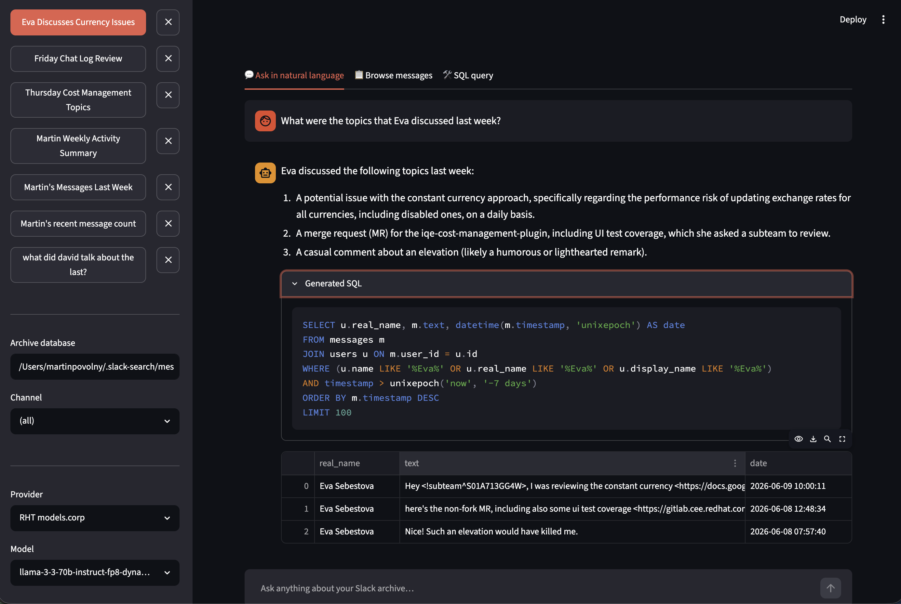

# slack-search (Python)

Original Python implementation with Streamlit web UI.

> **Note:** The Go binary (`slack-search`) is now the primary tool — it's faster, self-contained, and includes its own web UI and MCP server. This Python version is kept for prototyping new features.



## Requirements

- Python 3.11+
- [uv](https://docs.astral.sh/uv/) — `pip install uv`

## Loading data from Slack

### Enterprise Slack (xoxc- browser token)

1. Open Slack in Chrome, open DevTools → Network, find any `conversations.history` request, right-click → **Copy as cURL**, paste into `.curl`:

```bash
cat > .curl   # paste, then Ctrl-D
```

2. Download a channel:

```bash
uv run slack-search download --curl "$(cat .curl)" --channel cost-mgmt-dev --since "3 weeks ago" --no-files
```

Reruns are incremental — only new messages are fetched.

### Refreshing all channels at once

```bash
uv run slack-search refresh --curl "$(cat .curl)" --no-files
```

Use `--lookback N` to re-check threads from the last N days for new replies:

```bash
uv run slack-search refresh --curl "$(cat .curl)" --no-files --lookback 7
```

### Standard Slack (xoxp- / xoxb- token)

```bash
SLACK_TOKEN=xoxp-... uv run slack-search download --channel general --since "2024-01-01"
```

## Running the web UI

```bash
uv run streamlit run app.py
```

Open http://localhost:8501. Select a provider and model in the sidebar, then ask questions in the **Ask in natural language** tab. A **Max rows sent to LLM** selector (100 / 500 / 1000) above the chat input controls how many result rows are passed to the model during synthesis; the default is 100.

## Example queries

### Natural language (web UI or CLI)

```bash
# CLI — using a corporate model
uv run slack-search nlq --rht-model llama-3-3-70b-instruct-fp8-dynamic \
  "who sends the most messages?"

# CLI — using a local LM Studio model
uv run slack-search nlq --llm-url http://localhost:1234/v1 \
  --llm-model qwen/qwen3.6-27b \
  "what topics did the team discuss this week?"
```

### Raw SQL

```bash
uv run slack-search search \
  "SELECT u.real_name, count(*) AS msgs
   FROM messages m JOIN users u ON m.user_id=u.id
   GROUP BY u.id ORDER BY msgs DESC LIMIT 10"
```

### Grep

```bash
uv run slack-search grep -F "out of memory"
uv run slack-search grep -E "error|warning" --channel cost-mgmt-dev --since "2 weeks ago"
```

### Live search

```bash
uv run slack-search live-search --curl "$(cat .curl)" "out of memory"
```

The web UI exposes this as the **🔍 Slack Search** tab.

## LLM providers

| Provider | How to configure |
|---|---|
| **RHT models.corp** | Edit `.rht_models.json` (gitignored) with model keys |
| **LM Studio** | Start LM Studio — detected automatically on `localhost:1234` |
| **OpenCode.ai** | Set `OPENCODE_API_KEY` in `.env` |
